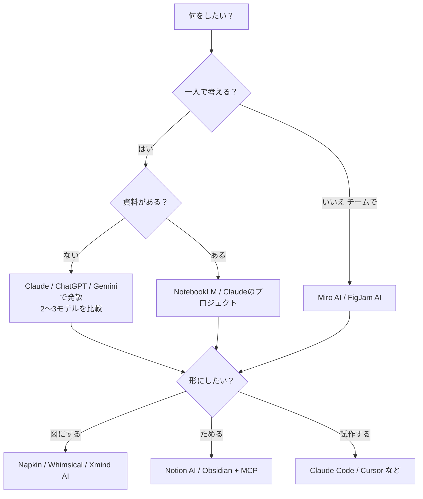

# AIを活用したアイデア出し（発想・企画）の効率的なやり方 完全ガイド

> 作成日：2026年10月1日
> 対象：企画職、クリエイター（小説・動画）、開発者、起業家、研究者、チームのファシリテーター
> 注意：AIツールの機能・料金・モデル名は変わるのが速いです。本文の「要確認」と書いた箇所は、この文書を書いた時点で一次情報を確認できなかったものです。使う前に公式サイトで確かめてください。

---

## 目次

- [3分で分かる要約](#summary)
- [第1章 なぜ今「AI×発想」なのか：研究から分かったこと](#ch1)
- [第2章 基本の型：発散→収束→検証の3段階ループ](#ch2)
- [第3章 発想フレームワーク×AI プロンプト集](#ch3)
  - [3.1 SCAMPER](#ch3-1)
  - [3.2 オズボーンのチェックリスト](#ch3-2)
  - [3.3 マンダラート](#ch3-3)
  - [3.4 KJ法（親和図法）](#ch3-4)
  - [3.5 6つの帽子（シックス・ハット）](#ch3-5)
  - [3.6 TRIZ](#ch3-6)
  - [3.7 ジョブ理論（Jobs to be Done）](#ch3-7)
  - [3.8 ペルソナ法・共感マップ](#ch3-8)
  - [3.9 逆転発想（リバース・ブレスト）](#ch3-9)
  - [3.10 そのほかの型：強制連想・HMW・シナリオ・プレモーテム](#ch3-10)
- [第4章 多様性を出す技術](#ch4)
- [第5章 評価と収束のさせ方](#ch5)
- [第6章 ツール別の使い分け](#ch6)
- [第7章 仕組み化：アイデア帳・Skills・定期ブレストの自動化](#ch7)
- [第8章 分野別の応用：小説・動画・開発・ビジネス企画](#ch8)
- [第9章 均質化の問題への対策と人間の役割](#ch9)
- [第10章 情報源・発信者・書籍（日英）](#ch10)
- [第11章 チェックリストと練習メニュー](#ch11)
- [付録 すぐ使えるプロンプト早見表](#appendix)

---

<a id="summary"></a>
## 3分で分かる要約

**結論：AIは「量を出す係」と「別の視点を持ち込む係」として使うと強い。ただし、何も工夫しないと誰が使っても似た答えになる。だから「誰が・どの型で・どの制約で」考えるかを人間が設計し、最後の選択と責任は人間が持つ。**

要点を7つにまとめます。

1. **AIは1人分のアイデアなら人より上手なこともあるが、全体で見ると似通る。** 2026年に出た複数の研究（PNAS Nexus掲載の "Large language models are homogeneously creative"、arXiv:2602.20408 など）は、LLMの答えは一つずつ見ると創造的でも、多数集めると人間の集団より似ている、と報告しています。何も工夫しないと「みんな同じアイデア」になりやすいのです。
2. **対策ははっきりしている。** 「普通の人」のペルソナを何人も演じさせる、考える手順を書かせる（Chain-of-Thought）、温度などの設定を変える、別のモデルと比べる、強い制約をかける。こうした工夫で多様性は上がる、という結果が出ています（詳しくは[第1章](#ch1)と[第4章](#ch4)）。
3. **フレームワークは「AIへの指示書」としてそのまま使える。** SCAMPER、マンダラート、6つの帽子、TRIZ、ジョブ理論などは、もともと人の思考の偏りを壊すための型です。AIに型を渡すと、出てくるものが「ありがちな10案」から「よく構造化された64案」に変わります（[第3章](#ch3)）。
4. **発散と収束を分ける。** 1回の指示で「アイデアを出して、いちばん良いものを選んで」と頼むと、AIは無難なものを選びがちです。「出す」「まとめる」「評価する」「試す」を別の手順に分けます（[第2章](#ch2)・[第5章](#ch5)）。
5. **ツールの役割を分ける。** 文章で考えるのはClaude / ChatGPT / Gemini。資料を読み込んで考えるのはNotebookLM。チームの付箋はMiro AI / FigJam AI。図にするのはNapkin / Whimsical / Xmind AI。ためておくのはNotion AI / Obsidian（[第6章](#ch6)）。
6. **仕組みにすると強くなる。** アイデア帳をMCP経由で自動でためる。発想の手順をSKILL.mdにまとめて毎回同じ品質で回す。週1回の自動ブレストで「アイデアの在庫」を増やす（[第7章](#ch7)）。
7. **人間の役割は「問いを立てる」「経験を持ち込む」「選ぶ」「責任を取る」。** AIが出したものを選ぶだけだと、自分の発想力が落ちるおそれがあります。まず自分で考えてからAIを使う「先に自分」の順番が大事です（[第9章](#ch9)）。

**今日からできる最小の手順（15分）**

```text
1. 自分で5分、アイデアを10個書く（AIは使わない）
2. AIに「普通の生活者ペルソナ5人」を作らせ、それぞれの立場で10案ずつ出させる
3. 自分の10案とAIの50案を並べ、「自分の案と似ていないもの」に印をつける
4. 印のついた案を3つ選び、AIに「この案がうまくいかない理由」を出させる
5. 生き残った1案を、明日できる小さな実験に変える
```

---

<a id="ch1"></a>
## 第1章 なぜ今「AI×発想」なのか：研究から分かったこと

### 1.1 AIは「1人の発想」を底上げする

2023年ごろから、「LLMは人と同じくらい、あるいは人より創造的か」を調べる研究が増えました。よく使われるのは、レンガやクリップのような身近な物の「別の使い道」をできるだけ多く挙げる **代替用途テスト（AUT）**、互いにできるだけ関係のない単語を並べる **DAT（Divergent Association Task）** などです。

多くの研究で、LLMはこうした課題で平均的な人と同じか、それ以上の点を取っています。PNAS Nexus（2026年、第5巻第3号）の論文 "Large language models are homogeneously creative" も、「LLMは標準的な創造性課題で人と同等かそれ以上」という先行研究の結果を確認しています。

ビジネスの現場でも、AIを使うとアイデアの量と、その場での質が上がるという報告は多いです。よく引用されるものとして、次のような研究があります（細かい数字は原典で確認してください）。

- **Doshi & Hauser（2024, Science Advances）**：短い小説を書く実験で、AIのアイデアを見た書き手は、作品が「より創造的」と評価されやすくなった。特に、もともとの創造性が低めの人で効果が大きかった。一方で、AIを使った人たちの作品どうしは似てきた。
- **Dell'Acqua ほか（2023, Harvard Business School ワーキングペーパー、通称 "Jagged Frontier" 論文）**：BCGのコンサルタントを対象にした実験。AIが得意な範囲の仕事では、成果の質と速さが大きく上がった。AIが苦手な範囲の仕事では、かえって正答率が下がった。
- **Si, Yang, Hashimoto（2024, arXiv "Can LLMs Generate Novel Research Ideas?"）**：NLPの研究アイデアを専門家とLLMで比べた。LLMのアイデアは「新しさ」で人より高く評価された。ただし実現しやすさはやや低く、たくさん出させると重複が多かった。

### 1.2 しかし「集団としては似てくる」

ここが本レポートでいちばん大事な点です。2026年に入って、次のような研究がそろってきました。

| 研究 | 主な発見 |
|---|---|
| PNAS Nexus "Large language models are homogeneously creative"（2026） | 多くのLLMの答えは、人間どうしの答えよりずっと似ている。モデルの「系統」をそろえても同じ。「もっと創造的に」とシステムプロンプトで頼んでも、少し良くなるだけ。**特定のモデルではなく、LLMを使うこと自体が均質化を生む可能性**を示した。 |
| arXiv:2602.20408 "Examining and Addressing Barriers to Diversity in LLM-Generated Ideas" | 多様性が下がる理由は2つ。①**固着**：最初に出した案に後の案が引っ張られる（人と同じ）。②**知識の集約**：人は一人ひとり違う知識を持つが、LLMは知識を一つの分布にまとめてしまう。対策として、**CoT（手順を書かせる）**は固着を減らす。**「普通の人」のペルソナ**（スティーブ・ジョブズのような「創造的な起業家」ではない人）は、意味の空間の別の場所から案を引き出す。両方を組み合わせると、多様性は人間を上回った。 |
| arXiv:2605.06540 "Ex Ante Evaluation of AI-Induced Idea Diversity Collapse" | アイデアは「混み合うと価値が下がる資源」だと考える。短編小説・広告コピー・代替用途課題で、最新LLM 3種はいずれも人間並みの多様性に届かなかった。ただし**温度の調整やペルソナを混ぜるプロンプト**で改善できた。 |
| arXiv:2606.09587 "Seeing the Hivemind"（Semantic Repulsion Technique） | AIの答えが集まりやすい「合意ゾーン」を見える形にし、そこから離れるように生成させる手法を提案。意味の多様性が85〜167%増え、決まり文句が43〜95%減った（参加者16人の予備的な研究）。 |
| Nature Human Behaviour（2026）"The shrinking landscape of linguistic diversity in the age of LLMs" | 88万件を超える文章の分析で、LLMで文章を整えると、書き方の複雑さのばらつきが21〜50%減ることを示した。発想そのものの研究ではないが、「AIを通すと個性がそろう」ことの根拠になる。 |

つまり、**「AIを使うと自分のアイデアは良くなる。でも、同じAIを使う競合のアイデアも同じ方向に良くなる」**ということです。企画、コンテンツ、プロダクトでは「ほかと違うこと」に価値があります。何も工夫せずにAIを使うと、平均点は上がっても差がつかない、という落とし穴にはまります。

### 1.3 このレポートの立場

上の研究をふまえ、このレポートは次の3つを原則にします。

1. **量はAI、方向は人間。** どの問いを、どの型で、どの立場から考えるかは人間が決める。
2. **多様性は「お願い」ではなく「設計」で出す。** 「もっと独創的に」と頼んでもあまり効かない。ペルソナ、制約、手順、複数のモデルという「仕組み」で多様性を作る。
3. **評価は分ける。** 生成したAIに自分の案を評価させない。評価の基準は先に決め、別の手順（できれば別のモデルや人）で評価する。

---

<a id="ch2"></a>
## 第2章 基本の型：発散→収束→検証の3段階ループ

### 2.1 ダブルダイヤモンドをAI向けに直す

デザインの世界では、英国デザイン協議会の「ダブルダイヤモンド」（発見→定義→展開→提供）がよく知られています。AIと組み合わせるときは、次の **6ステップ** にすると扱いやすくなります。

| ステップ | 目的 | AIの役割 | 人間の役割 |
|---|---|---|---|
| ① 問いを立てる | 何を考えるかを決める | 問いの言い換えを20個出す | どの問いに取り組むかを選ぶ |
| ② 材料を集める | 事実・声・事例を集める | 調べる、要約する、論点を出す | 一次情報（現場、顧客の声）を足す |
| ③ 発散 | とにかく量を出す | 型×ペルソナ×制約で大量に出す | 自分の案も先に出しておく |
| ④ 整理 | 似た案をまとめる | KJ法風にまとめ、軸を出す | まとめ方が正しいかを確かめる |
| ⑤ 収束・評価 | 良い案を選ぶ | 基準ごとに点をつけ、反論を出す | 最終的に選ぶ |
| ⑥ 検証 | 小さく試す | 実験計画や試作を作る | 実際に試し、結果から学ぶ |

### 2.2 1つのプロンプトに全部を詰めない

よくある失敗は、こういう頼み方です。

```text
新しいカフェのアイデアを考えて、一番いいものを選んで、事業計画にして。
```

これだと、AIは「よくある案」をいくつか出し、その中から「無難な案」を選び、「どこかで見た事業計画」を書きます。発散・収束・具体化を1回でやらせると、どの段階も浅くなります。

代わりに、手順を分けます。

```text
# ステップ1（問いの言い換えだけ）
「新しいカフェを作りたい」という課題を、
「どうすれば〜できるか（How Might We）」の形で20通りに言い換えてください。
・顧客の視点、店主の視点、地域の視点、時間帯の視点を混ぜること
・まだ答えは出さないこと
```

```text
# ステップ2（選んだ問いで発散）
問い：「どうすれば、在宅勤務の人が午後3時に5分だけ"人の気配"を感じられるか」
この問いに対して、アイデアを40個出してください。
・評価はしない。実現性も今は気にしない
・10個ごとに、それまでと違う方向を意識すること
・1案は1〜2行で
```

```text
# ステップ3（整理）
上の40案を、似たもの同士で6〜8グループにまとめてください。
各グループに「本質を表す一文の見出し」をつけ、
グループとグループの間にある「まだ誰も考えていない空白」を3つ挙げてください。
```

```text
# ステップ4（評価は別のチャットか別のモデルで）
以下の評価基準で、候補10案を1〜5点で採点してください。
基準：顧客の切実さ / 他店との違い / 初期費用の小ささ / 1週間で試せるか / 店主が続けたいか
採点の理由を1行ずつ。最後に、点数は低いが「化ける可能性がある案」を1つ選んでください。
```

### 2.3 「先に自分」ルール

研究では、AIの案を先に見ると、人の考えはそちらに引っ張られる（固着）ことが知られています。対策はかんたんです。

- **AIを開く前に、自分で5〜10分、紙かメモに案を書く。**
- その後でAIの案を見て、「自分の案と重なっていないもの」を探す。
- 自分の案をAIに渡し、「この案の延長ではない方向」で出させる。

```text
以下は私が自分で考えたアイデアです。
---
（自分の案を貼る）
---
これらと「同じ方向」の案は出さないでください。
私の案に共通する前提を3つ見つけ、その前提をくつがえす方向で20案出してください。
```

### 2.4 コンテキストを渡す

AIに出してもらうアイデアの質は、渡す情報の質でほぼ決まります。最低限、次の「企画ブリーフ」を渡しましょう。

```text
## 企画ブリーフ
- 目的：（何のために考えるのか。売上？ 認知？ 学習？）
- 対象：（誰のためか。できるだけ具体的に）
- 制約：（予算、期間、人数、技術、法律、ブランドの決まり）
- すでにある案・やったこと：（重複を避けるため）
- 成功の定義：（何が起きたら成功か）
- NG：（やりたくないこと、使いたくない表現）
- 出力形式：（数、長さ、表かリストか）
```

---

<a id="ch3"></a>
## 第3章 発想フレームワーク×AI プロンプト集

この章では、昔からある発想法をAI向けのプロンプトに変えて紹介します。共通のコツは3つです。

- **型の説明をプロンプトに書く。** AIは型の名前を知っていても、使い方がいいかげんなことがあります。手順をはっきり書きます。
- **出力を表にする。** 表にすると、抜けや偏りがすぐ分かります。
- **1回で終わらせない。** 型で出した案のうち「面白いもの」を選び、もう一度型にかけます。

以下のプロンプトの `{テーマ}` などは、自分の内容に置き換えてください。

<a id="ch3-1"></a>
### 3.1 SCAMPER

SCAMPERは、ボブ・エバール（Bob Eberle）がオズボーンのチェックリストをもとにまとめた7つの問いです。Substitute（置き換える）、Combine（組み合わせる）、Adapt（応用する）、Modify/Magnify（変える・大きくする）、Put to other uses（別の用途に使う）、Eliminate（なくす）、Reverse/Rearrange（逆にする・並べ替える）の頭文字です。

**基本プロンプト**

```text
あなたは製品企画のファシリテーターです。
対象：{既存の製品・サービス・作品}
目的：{目的}

SCAMPERの7つの観点それぞれで、アイデアを5個ずつ出してください（合計35個）。
- S 置き換える：素材・人・場所・手順・エネルギーを別のものに
- C 組み合わせる：別の製品・サービス・体験と合体させる
- A 応用する：別の業界・自然界・歴史から借りる
- M 変える・大きくする・小さくする：大きさ・頻度・速さ・色・形
- P 別の用途：別の人、別の場面、別の目的に使う
- E なくす：機能・手順・部品・費用を取り除く
- R 逆にする・並べ替える：順番、役割、上下、内と外を入れ替える

出力は表（観点 / アイデア / ひとこと説明 / 一番驚く点）で。
各観点の5個のうち、少なくとも1個は「ばかげているくらい大胆な案」にしてください。
```

**深掘りプロンプト（1つの観点を掘り下げる）**

```text
先ほどの表で、「E（なくす）」がいちばん可能性がありそうです。
{対象}から「なくせるもの」を、目に見えるもの・見えないもの（手間、待ち時間、判断、不安）を合わせて30個挙げてください。
それぞれ、「なくしたら誰が喜び、誰が困るか」を1行で添えてください。
```

**使いどころ**：今あるものの改良、商品のリニューアル、作品の続編やスピンオフ。何もないところから考えるのには向きません。

<a id="ch3-2"></a>
### 3.2 オズボーンのチェックリスト

ブレインストーミングを広めたアレックス・F・オズボーン（Alex F. Osborn）による9つの問いです。日本では「転用・応用・変更・拡大・縮小・代用・置換・逆転・結合」の9つとしてよく紹介されています。

```text
テーマ：{テーマ}
オズボーンのチェックリスト（転用・応用・変更・拡大・縮小・代用・置換・逆転・結合）の
9観点で、それぞれ4案ずつアイデアを出してください。

ルール：
1. 観点ごとに「問い」を自分で一文にしてから、答えを出すこと
   （例：拡大→「もし10倍の人数で使ったら？」）
2. 4案のうち1案は、ほかの業界の実例をヒントにすること（業界名を書く）
3. 最後に、36案の中から「2つの観点を組み合わせると化けそうな組」を3組提案すること
```

**SCAMPERとの違い**：ほぼ同じ発想ですが、オズボーンのほうが「拡大」「縮小」を分けているので、大きさや量を考えるのに向いています。両方を回すと、重なりを除いても新しい案が出ることが多いので、AIなら両方試すのが手軽です。

<a id="ch3-3"></a>
### 3.3 マンダラート

デザイナーの今泉浩晃氏が考えた、3×3のマスを使う発想法です。中央にテーマを置き、周りの8マスに関連することを書きます。その8つをそれぞれ新しい3×3の中心にして広げると、9×9＝81マス（テーマ1＋観点8＋アイデア64）になります。大谷翔平選手が高校時代に目標づくりに使ったことでも知られています。

**AIで作る64マス**

```text
マンダラートを作ります。
中心テーマ：{テーマ}

手順：
1. 中心テーマを支える「観点」を8つ挙げてください。
   条件：8つが互いに重ならないこと。「人・モノ・お金・時間・場所・感情・仕組み・外部環境」のように、
   別々の次元から選ぶこと
2. 8つの観点それぞれについて、具体的なアイデアや行動を8つずつ挙げてください（合計64）
3. 出力は、観点ごとに3×3の表（中央に観点名）を8つ並べた形式にしてください
4. 最後に、64個の中から「別の観点のマスと組み合わせると強くなる組」を5組挙げてください
```

**人とAIの分担例**

- 観点の8つは**人間が決める**（自分の価値観が出るため）。
- 64マスを埋めるのは**AIに任せる**。
- 埋まったマスに、人が「◎（やる）」「○（気になる）」「×（違う）」をつける。
- ◎のマスを中心に、もう一度マンダラートを作る（2段目）。

```text
私が決めた8つの観点は次のとおりです：
{観点1}、{観点2}、…、{観点8}
各観点について8つずつ埋めてください。
ただし、ありがちな案（検索の上位に出てきそうなもの）は各観点で最大2つまでにし、
残りは私の状況（{自分の状況}）に合わせた具体的な行動にしてください。
```

<a id="ch3-4"></a>
### 3.4 KJ法（親和図法）

文化人類学者の川喜田二郎氏が考えた方法です。1枚のカードに1つの情報を書き、似たもの同士を集めてグループにし、見出しをつけ、グループ間の関係を図にして、そこから文章にまとめます。

本来のKJ法は「先に分類の箱を作らず、下から集める」ことが大事です。AIは分類が得意な一方で、ありがちなカテゴリ（「価格」「品質」「サービス」など）に分けてしまいがちです。そこで、次のように指示します。

```text
以下は、顧客インタビューから書き出したメモ（1行1枚）です。
---
{メモを貼る（50〜300行）}
---
KJ法のやり方でまとめてください。

ルール：
1. 「価格」「品質」のような一般的なカテゴリ名を、先に決めないでください
2. 2〜4枚の「なんとなく近い」小グループを作り、そのグループの中身を
   一文で言い表す見出し（＝「〜なのに〜したい」のような、気持ちが分かる文）をつけてください
3. 小グループを中グループ、大グループにまとめていき、各段階の見出しをつけてください
4. どのグループにも入らない「はぐれカード」は無理に入れず、別にリストにしてください
5. 最後に、グループ同士の関係（原因→結果、対立、相互補完）をMermaid図で示してください
6. その図から読み取れる「意外な発見」を3つ、文章で書いてください
```

**ポイント**：「はぐれカード」の中に新しいアイデアの種があることが多いです。AIがむりにまとめないよう、はっきり書いておきます。Miro AIやFigJam AIの付箋クラスタリング機能を使うのも手です（[第6章](#ch6)）。

<a id="ch3-5"></a>
### 3.5 6つの帽子（シックス・ハット）

エドワード・デボノ（Edward de Bono）の思考法です。6色の帽子をかぶり分けるように、考え方の「モード」を切り替えます。

| 帽子 | モード |
|---|---|
| 白 | 事実・データ |
| 赤 | 感情・直感 |
| 黒 | 慎重・リスク |
| 黄 | 楽観・メリット |
| 緑 | 創造・新しい案 |
| 青 | 全体の進行・まとめ |

AIは「役を演じ分ける」のが得意なので、この方法ととても相性が良いです。

**1人で6人会議**

```text
これから「6つの帽子」の会議をします。議題：{議題・アイデア}

進め方：
1. 青の帽子として、議論のゴールと順番を宣言してください
2. 白 → 赤 → 黄 → 黒 → 緑 の順に、それぞれの帽子で200字ずつ発言してください
   - 白：分かっている事実と、分かっていない事実（調べるべきこと）を分ける
   - 赤：理由なしで、直感的な好き・嫌い・不安を言う
   - 黄：うまくいった場合に何が起きるか、具体的に
   - 黒：失敗の原因を3つ、起きる可能性の高い順に
   - 緑：黒が挙げた問題を逆に利用する案を含め、新しい案を5つ
3. 最後に青の帽子として、次にやることを3つにまとめてください

注意：ほかの帽子の意見に引きずられず、各帽子の役割に徹してください。
```

**帽子ごとに別のチャット・別のモデルで回す**：1つのチャットで6役をやらせると、口調も中身もだんだん似てきます。本気でやるなら、帽子ごとに新しいチャットを開くか、黒の帽子だけ別のモデルに任せると、違いがはっきり出ます。

<a id="ch3-6"></a>
### 3.6 TRIZ

TRIZ（トゥリーズ）は、旧ソ連のゲンリッヒ・アルトシュラー（Genrich Altshuller）が大量の特許を分析して作った「発明的問題解決の理論」です。中心にあるのは「**矛盾**」の考え方です。「強くしたいが軽くしたい」のように、何かを良くすると別の何かが悪くなる状態を、妥協ではなく解消する方法を探します。代表的な道具に「40の発明原理」と「矛盾マトリクス」があります。

AIはTRIZの40原理を知っていることが多いですが、番号と名前の対応を間違えることもあります。正確な一覧は書籍や専門サイトで確認し、プロンプトに貼りつけるのが安全です。

**矛盾の定式化から**

```text
TRIZの考え方で問題を解きます。
問題：{例：配達用の保冷ボックスを、もっと保冷力を高くしたいが、軽く・安くしたい}

手順：
1. 「技術的矛盾」の形で書き直してください：「Aを良くすると、Bが悪くなる」
   これを3通りの書き方で
2. 「物理的矛盾」の形でも書いてください：「Xは〜であるべきだが、同時に〜でないべきだ」
3. 物理的矛盾を解く4つの分離（時間で分ける / 空間で分ける / 条件で分ける / 全体と部分で分ける）
   のそれぞれで、解決案を2つずつ出してください
4. 40の発明原理のうち、この問題に効きそうなものを5つ選び、具体案に落としてください
   （原理の番号と名前を書き、私が確認できるようにしてください）
5. 「理想的な最終結果（IFR）」：コストも重さもゼロで機能だけがある状態を一文で書き、
   それに一番近い案を選んでください
```

**ビジネスへの応用**：TRIZはもともと技術の問題のためのものですが、「質を上げたいがコストを下げたい」「速くしたいが丁寧にしたい」のような、ビジネスやサービスの矛盾にも使えます。

```text
「丁寧な接客をしたいが、1人あたりの対応時間を半分にしたい」という矛盾があります。
TRIZの「分離の原理」（時間・空間・条件・全体と部分）を使って、
妥協ではない解決策をそれぞれ3つずつ出してください。
```

<a id="ch3-7"></a>
### 3.7 ジョブ理論（Jobs to be Done）

クレイトン・M・クリステンセン（Clayton M. Christensen）らの『ジョブ理論（Competing Against Luck）』で広く知られた考え方です。「人は製品を買うのではなく、自分の"片づけたい用事（ジョブ）"のために製品を"雇う"」と考えます。有名な例が「朝の通勤で、退屈をまぎらわせ、お腹を満たすためにミルクシェイクを雇う」という話です。

```text
対象：{製品・サービス}
この製品を「雇う」人のジョブを分析してください。

1. 機能的ジョブ（何をやり遂げたいか）、感情的ジョブ（どう感じたいか）、
   社会的ジョブ（周りにどう見られたいか）を、それぞれ5つずつ
2. それぞれのジョブについて、「状況（いつ・どこで・何をしているとき）」を具体的に書く
   形式：「〜のとき、私は〜したい。そうすれば〜できるから」
3. 今そのジョブのために「雇われている」もの（競合）を、同じ業界の外からも含めて挙げる
   （例：ミルクシェイクの競合はバナナ、ドーナツ、退屈しのぎのラジオ）
4. 今の解決策で「解雇したくなる瞬間」（不満・不安・手間）を挙げる
5. それをふまえた新しいアイデアを10個
```

**インタビュー前の仮説づくりにも使う**

```text
上のジョブの仮説を確かめるため、実際の顧客にインタビューしたいです。
「最後にそれを買った（使った）ときのこと」を具体的に思い出してもらう質問を、
誘導にならない形で12個作ってください。
（「〜は便利ですか？」のような、はい・いいえで答えられる質問は禁止）
```

**注意**：AIが出すジョブはあくまで仮説です。本当のジョブは顧客の生の声からしか分かりません。AIは「インタビューの準備」と「結果の整理」に使うのが正しい役割です。

<a id="ch3-8"></a>
### 3.8 ペルソナ法・共感マップ

ペルソナは、アラン・クーパー（Alan Cooper）がソフトウェア設計で広めた「具体的な架空の利用者像」です。AIではペルソナを「作る」ことと「演じさせる」ことの両方ができます。

**ペルソナを多めに作る（多様性のため）**

```text
{テーマ}の利用者になりうる人のペルソナを12人作ってください。

条件：
- 年齢、住む場所、仕事、家族構成、収入、デジタルへの慣れ、価値観がなるべく重ならないこと
- 「よくいるターゲット像」は最大3人まで。残りは「普通は考えないが、実は使うかもしれない人」
- 全員「ごく普通の人」にすること（有名人や「天才起業家」タイプは入れない）
- 各ペルソナに、そのテーマに関する「小さな困りごと」を1つずつ持たせる

出力：表（名前 / 属性 / 1日の流れのひとこと / 困りごと / 口ぐせ）
```

> 「普通の人」を指定するのには理由があります。前述の arXiv:2602.20408 では、スティーブ・ジョブズのような「創造的な起業家」のペルソナよりも、普通の人のペルソナのほうが、アイデアの多様性を高めたと報告されています。

**共感マップ**

```text
ペルソナ「{名前}」について、共感マップを作ってください。
- 考えていること・感じていること（口に出さない本音）
- 見ているもの（環境、周りの人、目に入る広告）
- 聞いていること（家族、同僚、SNS）
- 言っていること・やっていること（人前での行動）
- 痛み（不安、不満、障害）
- 得たいもの（望み、成功の基準）
最後に、「言っていること」と「本音」の間のズレを3つ挙げ、そこから生まれるアイデアを3つ出してください。
```

**ペルソナにインタビューする（ロールプレイ）**

```text
これから、あなたは「{ペルソナの説明}」として話してください。
私はインタビュアーです。
- その人が知らないはずのこと（業界用語、統計）は話さないでください
- 都合のいい答え方をせず、面倒くさがったり、話がそれたりしてかまいません
- 分からないことは「分からない」と答えてください
準備ができたら「はい」とだけ答えてください。
```

**注意**：AIのペルソナは本物の顧客ではありません。「仮説を増やす」「質問を練習する」ためのものであり、「顧客がこう言ったから正しい」という根拠には使えません。

<a id="ch3-9"></a>
### 3.9 逆転発想（リバース・ブレスト）

「どうすれば成功するか」ではなく、「**どうすれば最悪にできるか**」を考え、それを逆にする方法です。人は「良いアイデア」を出そうとすると固くなりますが、「ひどいアイデア」は気楽に出せます。AIも同じで、逆にすると型にはまった答えから抜けやすくなります。

```text
テーマ：{例：新入社員の最初の1週間}
1. この体験を「最悪」にする方法を30個、具体的に挙げてください
   （例：初日に誰も名前を覚えていない）。遠慮はいりません
2. 30個それぞれを逆にして、「最高にする方法」に変えてください
3. 逆にした案のうち、ふつうに考えたら思いつかなそうなものを5つ選び、理由を書いてください
```

**前提ひっくり返し（Assumption Reversal）**

```text
{業界・テーマ}で「当たり前」とされている前提を15個挙げてください。
（例：レストランでは客が店に来る、メニューは店が決める、料金は食後に払う）
それぞれを逆にした世界を1行で描写し、
その世界で成り立つビジネスやサービスを1つずつ考えてください。
```

<a id="ch3-10"></a>
### 3.10 そのほかの型：強制連想・HMW・シナリオ・プレモーテム

**強制連想（ランダム刺激）**：関係のない言葉を無理やり結びつけます。AIが選ぶ「ランダムな言葉」はランダムでないことが多いので、**言葉は自分で選ぶか、辞書やサイコロで決める**のがコツです。

```text
テーマ：{テーマ}
次の5つの言葉は、私が辞書を適当に開いて選んだものです：{言葉1}、{言葉2}、{言葉3}、{言葉4}、{言葉5}
それぞれの言葉の「性質」を5つずつ挙げ（例：「たこ焼き」→丸い、中が熱い、みんなで分ける、屋台、ひっくり返す）、
その性質をテーマに当てはめたアイデアを、言葉ごとに3つずつ出してください。
```

**HMW（How Might We：どうすれば〜できるか）**：問題を「問い」に変えて、問いの段階で広げます。

```text
課題：{課題}
この課題を「どうすれば〜できるか」という問いに、20通りで言い換えてください。
- 範囲を広げた問い（もっと大きな目的）を5つ
- 範囲を狭めた問い（具体的な一場面）を5つ
- 課題の「良い面」を伸ばす問いを5つ
- 前提を疑う問いを5つ
```

**シナリオ・プランニング**：未来の不確かさを2本の軸で組み合わせ、4つの世界を描きます。

```text
テーマ：{2030年の○○業界}
1. 影響が大きく、どうなるか分からない要因を10個挙げてください
2. その中から、互いに関係が薄い2つを軸に選び、2×2の4つの未来を作ってください
3. 各未来に名前をつけ、そこで暮らす人の1日を300字で描いてください
4. 4つの未来のどれでも役に立つ「強い一手」と、1つの未来でだけ大当たりする「賭けの一手」を、それぞれ3つ挙げてください
```

**プレモーテム（死亡前死因分析）**：心理学者ゲーリー・クライン（Gary Klein）が提案した方法です。「1年後、このプロジェクトは大失敗した。なぜか？」と、失敗したことにして理由を考えます。

```text
アイデア：{アイデア}
今は1年後です。このアイデアは大失敗に終わりました。
1. 失敗した理由を、ありそうな順に10個、ニュース記事の見出しのように書いてください
2. それぞれについて、今のうちにできる予防策を1つずつ
3. 予防策をとっても防げない「致命的な理由」があれば、正直に挙げてください
```

**アナロジー（類推）**：遠い分野から仕組みを借ります。

```text
課題：{課題}
この課題と「構造が似ている」問題を、まったく違う分野（生物、軍事、料理、スポーツ、宗教、都市計画、ゲーム）からそれぞれ1つずつ探し、
その分野でどう解決されているかを説明し、私の課題に当てはめた案を出してください。
```

---

<a id="ch4"></a>
## 第4章 多様性を出す技術

第1章で見たように、AIの答えは何もしないと似通います。この章では、多様性を「仕組みで」出す方法を、手軽なものから順に紹介します。

### 4.1 温度などのサンプリング設定

LLMには、次の言葉をどれくらい「ばらつかせて」選ぶかを決める設定があります。代表的なものが **temperature（温度）** と **top_p** です。温度を上げると、確率の低い言葉も選ばれやすくなり、答えのばらつきが増えます。arXiv:2605.06540 でも、温度の調整で「混み合い」を減らせたと報告されています。

ただし、実際に使うときは次の点に気をつけてください。

- **チャット画面（ChatGPT、Claude.ai、Geminiアプリ）では、温度を直接変えられないことが多い**です。変えたいときは、APIや開発者向けの画面（OpenAI Playground、Anthropic Console、Google AI Studio など）を使います。どの画面でどの設定が使えるかは時期によって変わるので「要確認」です。
- **推論（reasoning / thinking）モデルでは、温度が固定されている、または変えられないものがあります**（要確認：各社APIドキュメント）。
- 温度を上げすぎると、意味の通らない答えが増えます。発散では高め、評価やまとめでは低め、と使い分けます。

**温度の代わりにできること（チャット画面向け）**

```text
同じ問いに対して、以下の5つの「スタイル」でそれぞれ5案ずつ出してください。
1. 一番ありそうな案（確率が高そうなもの）
2. 10人に1人しか思いつかない案
3. 100人に1人しか思いつかない案
4. 業界の人が聞いたら怒りそうな案
5. 子どもが言いそうな案
各案に、自分で見積もった「ありがちさ」（1〜10）をつけてください。
```

これは「言語化されたサンプリング（verbalized sampling）」と呼ばれるアイデアに近いやり方で、「確率の低い案を、自分で確率を見積もりながら出させる」ことで、ありがちな案から離れさせます（この手法名の論文の詳細は要確認）。

### 4.2 「新しいチャット」と「複数回の生成」

同じチャットの中で「もっと出して」と続けると、前の答えに引っ張られて（固着）、だんだん同じような案になります。

- **固着を避ける**：同じプロンプトを、**新しいチャットで3〜5回**別々に実行し、結果を合わせる。
- **重複を除く**：合わせた結果をAIに渡し、「意味が同じものをまとめ、独自の案だけを残して」と頼む。

```text
以下は、同じ問いを5回別々に生成した結果です（合計100案）。
---
{貼りつけ}
---
1. 意味がほぼ同じ案をまとめ、それぞれのまとまりに何回出てきたかを書いてください
2. 5回中4回以上出てきた案は「ありがち案」、1回だけの案は「レア案」としてください
3. レア案だけを一覧にし、その中から伸ばしがいのあるものを5つ選んでください
```

「何回も出てくる案＝AIの合意ゾーン」です。これは、**競合も思いつく可能性が高い案**の目安になります。arXiv:2606.09587（Semantic Repulsion）も、この「合意」を見える形にして避けることを提案しています。

### 4.3 複数モデルの比較

Claude、ChatGPT（GPTシリーズ）、Gemini、そのほかのオープンモデルは、学習データも調整の仕方も違うので、答えの癖も違います。ただし、PNAS Nexusの研究のとおり、**モデルを替えても多様性は人間ほどにはならない**ことに注意してください。

**実践的なやり方**

1. 同じ企画ブリーフを3つのモデルに渡す。
2. 結果を1つの表にまとめ、「1つのモデルだけが出した案」に印をつける。
3. 評価は、生成に使っていないモデル（または人）に任せる。

```text
以下は、同じ問いに対して3つのAI（A, B, C）が出した案です。
どの案がどのAIのものかは伏せてあります。
---
{案を番号つきで並べる}
---
1. 似ている案をまとめ、まとまりごとに番号を並べてください
2. どのまとまりにも入らない案を挙げてください
3. この問いの「答えの空間」の中で、3つのAIのどれも触れていない領域を3つ指摘してください
```

> 複数のモデルを一度に比べられるツール（ブラウザで複数のモデルに同じ質問を送れるサービスや、OpenRouterのような複数モデルをまとめて使えるAPIなど）もあります。具体的なサービスの機能や料金は変わりやすいので要確認です。

### 4.4 ペルソナ討論

AIに、立場の違う人どうしで議論させる方法です。

```text
テーマ：{テーマ}
次の4人で討論をしてください。全員「ごく普通の人」です。
- 佐藤さん（68歳、地方で一人暮らし、元郵便局員、スマホは孫に習いながら）
- ミンさん（29歳、都内で働くベトナム出身のエンジニア、日本語は仕事レベル）
- 田中さん（41歳、パートで働く3児の母、時間がいつもない）
- 山本さん（17歳、高校生、部活とバイトで忙しい）

ルール：
1. まず全員が、テーマについて「自分の生活で困っていること」を1つずつ話す
2. 次に、自分以外の人の困りごとに対して「自分ならこうする」と案を出す
3. お互いの案に、遠慮なく「自分には合わない理由」を言う
4. 最後に、4人全員が「これなら使うかも」と言える案を1つ作る
各発言は100字以内。1人の意見に全員がすぐ賛成しないこと。
```

**ペルソナの選び方のコツ**

- 年齢・地域・職業・文化・身体の条件・価値観をばらつかせる。
- 「専門家」と「素人」を混ぜる。素人の質問から盲点が見つかることが多い。
- 毎回同じペルソナを使わない。ペルソナのリストを用意し、ランダムに選ぶ（[第7章](#ch7)で自動化）。

### 4.5 マルチエージェント議論

ペルソナ討論を1つのチャット内でやると、結局は1つのモデルが全員を演じるので、似てきます。さらに一歩進めると、**役割ごとに別のエージェント（別のチャット、別のモデル、別のシステムプロンプト）** を動かし、その間で案をやりとりさせる方法があります。

**典型的な役割の組み合わせ**

| 役割 | やること | 向いている設定 |
|---|---|---|
| 発散役（ジェネレーター） | 案をたくさん出す | 温度高め、ペルソナあり |
| 批判役（クリティック） | 弱点・前例・リスクを指摘 | 温度低め、別のモデル |
| 統合役（シンセサイザー） | 案を組み合わせ、良くする | 中くらい |
| 審査役（ジャッジ） | 基準に沿って点をつける | 温度低め、生成に使っていないモデル |
| 進行役（ファシリテーター） | 順番と終了の判断 | 人間でもよい |

**手動でやる場合のプロンプト**（チャットを3つ開いて、結果をコピーして渡す）

```text
# 発散役（チャット1）
あなたは発想担当です。{テーマ}について、30案を出してください。
評価は別の担当がするので、ここでは質より量と幅を優先してください。
```

```text
# 批判役（チャット2、できれば別のモデル）
あなたは辛口の批評家です。以下の30案それぞれに、
「すでに似たものがある可能性（ありそうな例を書く。確かでなければ"要確認"と書く）」
「一番大きな弱点」を1行ずつ書いてください。
ほめる必要はありません。
---
{30案}
```

```text
# 統合役（チャット3）
以下は、案とそれへの批判です。
批判を「乗り越える」形で、案を組み合わせたり作り直したりして、
新しい案を10個作ってください。元の案の番号を必ず書いてください。
---
{案＋批判}
```

**自動でやる場合**：Claude Code、OpenAI Agents SDK、Google の Agent Development Kit（ADK）、LangGraph、CrewAI、AutoGen などのエージェント開発の仕組みを使うと、この流れをプログラムで回せます。各フレームワークの最新の書き方は変わりやすいので、公式ドキュメントを確認してください（要確認）。簡単な疑似コードは次のとおりです。

```python
# 疑似コード：3役のマルチエージェント・ブレスト
topic = "地方の書店が若い人を呼び込む方法"
personas = sample(PERSONA_POOL, k=5)          # 普通の人ペルソナを5人ランダムに

ideas = []
for p in personas:                             # 固着を避けるため、毎回新しい会話
    ideas += llm_a.generate(
        system=f"あなたは{p}です。自分の生活から考えてください。",
        prompt=f"{topic}について、手順を書いてから10案出す",
        temperature=1.0,
    )

ideas = dedupe_by_embedding(ideas, threshold=0.85)   # 意味が近いものをまとめる
critiques = llm_b.critique(ideas, temperature=0.2)   # 別のモデルで批判
improved = llm_c.synthesize(ideas, critiques)        # 統合・改良
scores = llm_judge.score(improved, rubric=RUBRIC)    # 生成に使っていないモデルで採点
save_to_idea_bank(improved, scores)                  # アイデア帳に保存（第7章）
```

**注意点**：エージェントを増やすと費用と時間がかかります。また、エージェントどうしで「なれ合い」が起きて、批判が弱くなることもあります。批判役には「必ず3つ以上の弱点を挙げる」のような**ノルマ**をつけるのが効果的です。

### 4.6 制約をつける

ふしぎなことに、「自由に考えて」より「制約つきで考えて」のほうが、ありがちな答えから離れやすくなります。

**制約の種類**

| 種類 | 例 |
|---|---|
| 資源 | 予算1万円、1人で、1週間で |
| 禁止 | 「アプリ」「AI」「サブスク」という言葉を使わない |
| 形式 | 必ず紙で、必ず音だけで、必ず屋外で |
| 対象 | 80歳以上だけ、左利きの人だけ |
| 組み合わせ | 必ず「お寺」と組み合わせる |
| 極端 | 価格を100倍に、時間を1/10に |
| 時代 | 江戸時代に同じことをするなら |

```text
テーマ：{テーマ}
次の「禁止ワード」を使わずに、アイデアを20個出してください。
禁止ワード：アプリ、AI、SNS、サブスク、ポイント、コミュニティ、パーソナライズ、DX
（これらはAIや企画書によく出てくる言葉なので、あえて禁止します）
```

> 禁止ワードのリストは、自分がふだんAIに頼んだときによく出てくる言葉から作ると効果的です。[第7章](#ch7)で、これを自動で育てる方法を紹介します。

**制約の掛け算**

```text
次の3つの軸から1つずつ選んだ組み合わせ（全部で27通り）すべてについて、アイデアを1つずつ出してください。
軸1（対象）：子ども / 高齢者 / 外国人観光客
軸2（場所）：駅 / 病院 / 公園
軸3（時間）：朝5分 / 待ち時間 / 夜寝る前
```

この「形態分析（モルフォロジカル分析）」は、フリッツ・ツビッキー（Fritz Zwicky）が整理した方法で、AIに表を全部埋めさせるのに向いています。

### 4.7 CoT（考える手順を書かせる）で固着を減らす

arXiv:2602.20408 では、「手順を書かせる」ことがLLMの固着を減らし、ペルソナと組み合わせると最も多様性が上がったと報告されています。

```text
あなたは{普通の人ペルソナ}です。
{テーマ}についてアイデアを1つ出す前に、次の手順で考えてください。
1. 自分の生活の中で、このテーマに関係する場面を1つ思い出す
2. その場面で、自分が感じる小さな不満を1つ挙げる
3. その不満を、自分ならどうやって解決したいか考える
4. それをアイデアとして1〜2文にまとめる
この手順を、毎回違う場面を思い出しながら10回くり返してください。
```

---

<a id="ch5"></a>
## 第5章 評価と収束のさせ方

### 5.1 「評価の基準」を先に決める

アイデアを出したあとで基準を決めると、気に入った案に合わせて基準を作ってしまいます。**基準は発散の前に決めます。**

**よく使う評価軸**

| 軸 | 問い |
|---|---|
| 切実さ（Desirability） | 本当に困っている人がいるか |
| 実現性（Feasibility） | 今の技術・人・お金でできるか |
| 事業性（Viability） | 続けられるか、お金が回るか |
| 新しさ（Novelty） | ほかとはっきり違うか |
| 試しやすさ（Testability） | 1〜2週間で小さく試せるか |
| 自分ごと（Fit） | 自分（自社）がやる理由があるか |

最初の3つは、IDEOがよく使う「デザイン思考の3つのレンズ（Desirability / Feasibility / Viability）」として知られています。

### 5.2 AIに採点させるときのコツ

AIの採点には、次のような偏りがあることが知られています（「LLM-as-a-judge」の研究で報告されているもの）。

- 長い説明の案を高く評価しがち
- 最初や最後に並んだ案を高く評価しがち（順番の影響）
- 自分（同じモデル）が作った案を高く評価しがち
- 無難な案を「実現性が高い」として高く評価しがち

**対策**

```text
以下の20案を評価してください。

条件：
- 各案を、同じ長さ（1文）にそろえてから評価してください
- 評価基準と点数の意味は次のとおりです
  切実さ：1=困っている人を思い浮かべられない / 3=少しいる / 5=はっきり、具体的にいる
  新しさ：1=検索すればすぐ同じものが出てきそう / 3=組み合わせは新しい / 5=聞いたことがない
  試しやすさ：1=半年以上かかる / 3=1か月 / 5=1週間以内に試せる
- 点数の前に、必ず理由を1行書いてください
- 全体の平均が3点になるように、点数を散らしてください（全部4点のようにしない）
```

**順番を入れ替えて2回評価する**：同じ案を、並び順を変えてもう一度評価させ、点が大きく変わった案は「評価が安定しない案」として人が見ます。

**ペア比較（トーナメント）**：点数をつけるより、「AとBのどちらが良いか」を比べるほうが、AIの判断は安定しやすいです。

```text
次の2つの案のうち、「{目的}」にとってより良いのはどちらですか。
理由を3行で書いてから、AかBかを答えてください。
案A：{案}
案B：{案}
```

### 5.3 「捨てる」ための収束

収束でいちばん大事なのは、「良い案を選ぶ」ことより「捨てる理由をはっきりさせる」ことです。

```text
以下の10案について、「今回は見送る」場合の理由を、それぞれ1行で書いてください。
そのうえで、理由がいちばん弱い（＝見送るのがもったいない）案を3つ選んでください。
```

**2軸マップで見える化する**

```text
以下の案を、横軸「新しさ」、縦軸「試しやすさ」の2軸で、
4つのエリア（すぐやる / 準備してやる / 寝かせる / 捨てる）に分けてください。
Mermaidのquadrantチャートで出力してください。
```

### 5.4 「化ける案」を残す

点数が低い案の中に、時間がたつと価値が出る案があります。収束のときに、**点数とは別に「化ける枠」を1〜2個**とっておくと、均質化への対策にもなります。

```text
点数は低いけれど、次の条件のどれかに当てはまる案を2つ選んでください。
- 技術や社会の変化で、2〜3年後に一気に現実的になりそう
- 一部の人にとっては、ものすごく強く刺さりそう
- ほかの案と組み合わせると、別物になりそう
```

### 5.5 検証につなげる

選んだ案は、すぐに「小さな実験」に落とします。

```text
アイデア：{アイデア}
このアイデアのいちばん大事な「仮説」（これが外れたら全部ダメになる前提）を3つ挙げてください。
それぞれについて、
- 1週間以内、予算1万円以内でできる確かめ方
- 「仮説が正しい」と判断する数字の目安
- 「仮説が外れた」と判断する数字の目安
を書いてください。
```

---

<a id="ch6"></a>
## 第6章 ツール別の使い分け

ツールの機能や料金はとても速く変わります。ここでは「どんな役割に向いているか」を中心に書き、細かい機能は公式ページで確認してください。

### 6.1 対話型AI：Claude / ChatGPT / Gemini

| ツール | 発想での得意なこと（筆者の見立て） | 確認したいこと |
|---|---|---|
| Claude（Anthropic） | 長い資料を読んで考える、文章の質、役割演技、プロジェクト単位で資料を置いておける。Skills（SKILL.md）で手順を再利用できる | 利用できるプラン・機能（要確認） |
| ChatGPT（OpenAI） | 画像生成と組み合わせた発想、カスタムGPT、メモリ機能、Canvas、エージェント機能 | 最新のモデル名・機能（要確認） |
| Gemini（Google） | Google検索やGoogleドライブとの連携、とても長い入力、Gems（カスタム設定） | Workspaceとの連携範囲（要確認） |

**使い分けの考え方**

- **発散はモデルを替えて2〜3個使う。** 1つのモデルだけだと癖が出ます。
- **評価は、生成に使っていないモデルで。**
- **「プロジェクト」「Gems」「カスタムGPT」などの機能に企画ブリーフを置いておく。** 毎回説明しなくてよくなります。
- **メモリ機能には注意。** 過去の会話を覚えていると、自分の好みに寄りすぎることがあります。まっさらな発想が欲しいときは、メモリをオフにするか、一時的なチャットを使います。

### 6.2 NotebookLM（Google）

NotebookLMは、自分が入れた資料（PDF、Webページ、Googleドキュメント、動画の文字起こしなど）だけをもとに答えるAIノートです。音声で資料を解説する「音声解説（Audio Overview）」や、マインドマップを作る機能などが知られています（機能の最新の範囲は要確認）。

**発想での使い方**

- 顧客インタビューの記録、アンケートの自由回答、業界レポートを入れて、「この中で、まだ誰も解決していない困りごとは？」と聞く。
- 論文や本を入れて、「この考え方を{自分のテーマ}に当てはめると？」と聞く。
- 資料にない推測をしにくいので、**「材料を集める」「整理する」段階に向いている**。逆に、自由な発散には別のAIを使う。

```text
（NotebookLMで）
入れた資料の中から、
1. 何度も出てくる不満
2. 1回しか出てこないが、強い感情がこもっている声
3. 資料どうしで食い違っている点
を、それぞれ出典つきで挙げてください。
```

### 6.3 ホワイトボード系：Miro AI / FigJam AI / Whimsical

**Miro AI**：Miroのヘルプセンターによると、Miro AIには、文章からのアイデアや図の生成、ボード上の付箋やコメントの要約、付箋をキーワードや感情で自動的にまとめる「クラスタリング」、マインドマップ、翻訳などの機能があります。2026年1月には、企業向けに「AI Workflows」（複数の手順をつなぐFlows、目的別の会話エージェントSidekicksなど）を発表しています（出典：Miro公式ニュースルーム「Miro launches collaborative AI Workflows」2026年1月12日）。ヘルプセンターの参照ページでは、機能ごとに使っているモデルの一覧も公開されています。

**使い方**：チームのブレストで付箋を大量に出したあと、Miro AIでまとめ、まとめ方を人が直す。リモートの会議で特に役立ちます。

**FigJam AI**：Figmaのホワイトボードです。付箋の自動整理、要約、テンプレートの生成などのAI機能があります。Figmaでデザインしているチームなら、アイデアからデザインへの受け渡しがなめらかです。比較記事では、AI機能の深さはMiroのほうが上という評価も見られます（機能の現状は要確認）。

**Whimsical**：フローチャート、ワイヤーフレーム、マインドマップを手早く、きれいに作れるツールです。AIでマインドマップやフローチャートを生成する機能が知られていますが、2026年の比較記事の中には「AI機能は限定的」と評価するものもあり、評価が分かれます（最新の機能は要確認）。

### 6.4 マインドマップ・図解系：Xmind AI / Napkin

**Xmind AI**：マインドマップの定番ツールXmindのAI機能です。テーマを入れると枝を広げる、マップを要約する、といった使い方ができます（提供形態と機能の詳細は要確認）。マンダラートやロジックツリーを、AIで広げてから人が刈り込む使い方に向いています。

**Napkin（Napkin AI）**：文章を貼ると、それに合った図（フローチャート、比較図、マインドマップ、インフォグラフィックなど）を作ってくれるツールです。編集できる図として出力でき、ブランドに合わせた見た目にもできます。**アイデアを「伝える」段階**で強く、企画書やプレゼン用の図を作る時間を大きく減らせます。

### 6.5 ノート・蓄積系：Notion AI / Obsidian

**Notion AI**：Notionのページやデータベースの中でAIを使えます。アイデアのデータベースを作り、AIで要約・タグづけ・似た案の検索をする使い方に向いています。Notionは公式のMCPサーバーを提供しているとされ、外部のAIエージェントからNotionを読み書きできます（提供状況は要確認）。

**Obsidian**：ローカルのMarkdownファイルでノートを管理するアプリです。ファイルが手元にあるので、Claude CodeなどのAIエージェントから直接読み書きしやすいのが強みです。コミュニティのプラグインやMCPサーバーで、AIとつなぐ方法がいくつも公開されています（個々のプラグインの品質・安全性は要確認）。

### 6.6 そのほか

| 用途 | ツールの例 | メモ |
|---|---|---|
| 画像で発想 | ChatGPTの画像生成、Gemini、Midjourney、Adobe Firefly | ビジュアルのラフ、ムードボード |
| 動画の企画 | 各種動画生成AI | 絵コンテ・雰囲気の確認に。商用利用の条件は要確認 |
| 音声で考える | スマホの音声入力＋AI、NotebookLMの音声解説 | 散歩しながらのブレスト |
| 開発 | Claude Code、Cursor、GitHub Copilot など | 試作品をすぐ作って確かめる |
| 調査 | Perplexity、各AIの「Deep Research」系機能 | 材料集め。出典は必ず自分で確認 |

### 6.7 ツール選びのフローチャート



---

<a id="ch7"></a>
## 第7章 仕組み化：アイデア帳・Skills・定期ブレストの自動化

一度きりのブレストより、**アイデアを毎日少しずつためて、ときどき見直す仕組み**のほうが、長い目で見て強いです。この章では、それをAIで作る方法を紹介します。

### 7.1 アイデア帳の設計

**1件のアイデアに持たせる情報（テンプレート）**

```markdown
---
id: idea-2026-10-01-001
title: 午後3時の「5分だけ相席」カフェ
created: 2026-10-01
source: 自分 / AI(Claude) / AI(GPT) / 会話 / 読書 / 散歩
framework: SCAMPER-E
status: seed   # seed / growing / testing / done / dropped
tags: [カフェ, 在宅勤務, 孤独]
scores: {切実さ: 4, 新しさ: 3, 試しやすさ: 5}
related: [idea-2026-09-12-004]
---

## 一言で
在宅勤務の人が、午後3時に5分だけ知らない人と相席できる仕組み。

## きっかけ
（何を見て、何を思ったか。ここは自分の言葉で書く）

## 仮説
- 在宅勤務の人は「話したい」のではなく「人の気配が欲しい」

## 次の一歩
- 近所のカフェ1軒に話を聞く
```

**大事なポイント**

- **「出どころ（source）」を必ず書く。** あとで「AIの案ばかり残っている」「自分の案が減っている」と気づけます。
- **「きっかけ」は自分の言葉で書く。** ここがその人だけの経験で、均質化への一番の対策です。
- **状態（status）を持たせる。** ためるだけでなく、育てる・捨てるの判断ができます。

### 7.2 Obsidian＋AIエージェントで自動蓄積

Obsidianのノートはただのファイルなので、Claude Codeのようなファイルを読み書きできるAIエージェントから直接扱えます。

**フォルダ構成の例**

```text
IdeaVault/
├── 00_inbox/          # とりあえず放り込む
├── 10_ideas/          # 1アイデア1ファイル（上のテンプレート）
├── 20_themes/         # テーマごとのまとめ
├── 30_sessions/       # ブレストの記録
├── 90_meta/
│   ├── banned_words.md    # AIがよく使う「ありがちワード」リスト
│   ├── personas.md        # ペルソナのプール
│   └── rubric.md          # 評価基準
└── CLAUDE.md          # エージェントへの説明（このフォルダのルール）
```

**エージェントに頼むこと（例）**

```text
00_inbox/ にあるメモを読み、
1. 1つのメモに複数のアイデアがあれば分ける
2. 10_ideas/ のテンプレートに沿って1ファイル1アイデアで保存する
3. 既存のアイデアと意味が近いものがあれば related に書き、新しいファイルは作らずに追記する
4. 「きっかけ」欄は、元のメモの言葉をそのまま使い、書き換えない
5. 最後に、今日増えたアイデアの一覧を 30_sessions/ に日付つきで書く
```

### 7.3 Notion＋MCPで自動蓄積

MCP（Model Context Protocol）は、AIアプリと外部のツールやデータをつなぐための共通の仕組みで、Anthropicが2024年11月に公開しました。今では多くのAIアプリが対応しています。NotionのMCPサーバーを使うと、AIとの会話の中で「このアイデアをNotionのアイデアDBに保存して」と頼めます（設定方法は各アプリとNotionの公式ドキュメントで要確認）。

**NotionのアイデアDBのプロパティ例**

| プロパティ | 種類 | 例 |
|---|---|---|
| タイトル | タイトル | 午後3時の5分相席 |
| 出どころ | セレクト | 自分 / AI / 会話 / 読書 |
| フレームワーク | セレクト | SCAMPER / TRIZ / JTBD … |
| 状態 | ステータス | 種 / 育成中 / 検証中 / 完了 / 見送り |
| 点数 | 数値 | 切実さ・新しさ・試しやすさ |
| きっかけ | テキスト | 自分の言葉で |
| 関連 | リレーション | ほかのアイデア |
| 次の一歩 | テキスト | 近所のカフェに話を聞く |

**会話の最後に毎回使うプロンプト**

```text
この会話で出たアイデアのうち、私が「いいね」と言ったものだけを、
NotionのアイデアDBに保存してください。
- 出どころは「AI(このモデル名)」、フレームワークは使ったものを
- 状態は「種」
- 「きっかけ」欄は空にしておいてください（あとで私が書きます）
保存する前に、一覧を見せて確認をとってください。
```

> 「保存する前に確認をとる」は大事です。AIが勝手に大量のページを作ると、アイデア帳がゴミだらけになります。

### 7.4 Skills（SKILL.md）で発想の手順を再利用する

Anthropicの **Agent Skills** は、AIに覚えさせたい手順や知識をフォルダにまとめたものです。Anthropicのドキュメント（docs.claude.com の Agent Skills の解説）と、公開されている仕様（agentskills.io）によると、Skillは少なくとも `SKILL.md` というファイルを持つフォルダで、ファイルの最初にYAMLの前置き（フロントマター）を書きます。

- **必須の項目は `name` と `description`。**
- `name` は64文字以内で、英小文字・数字・ハイフンだけ。Anthropicのドキュメントでは、「anthropic」「claude」という予約語は使えないとされています。仕様では、フォルダ名と同じにすることになっています。
- `description` は1024文字以内。**「何をするか」と「いつ使うか」の両方を書く**。AIは最初はこの説明だけを読み、関係がありそうなときに本文を読みに行きます（段階的な読み込み）。
- 本文には手順や例を自由に書けます。長い資料は別のファイルに分け、本文から参照します。

**例：ブレスト用Skill**

```text
ideation-session/
├── SKILL.md
├── frameworks.md       # SCAMPER、TRIZなどの手順の詳細
├── personas.md         # 普通の人ペルソナのプール（50人分）
├── banned_words.md     # ありがちワードのリスト
└── rubric.md           # 評価基準
```

```markdown
---
name: ideation-session
description: 企画・新商品・コンテンツのアイデア出しを、発散→整理→評価の手順で行う。ユーザーが「アイデアを出したい」「ブレストしたい」「企画を考えたい」「ネタがほしい」と言ったときに使う。
---

# アイデア出しセッション

## 手順
1. **ブリーフの確認**：目的・対象・制約・既存の案・成功の定義を聞く。足りなければ質問する（最大5問）。
2. **先に自分**：ユーザーに「AIの案を見る前に、自分の案を3つ以上書いてください」と頼む。
   ユーザーが断った場合は先に進む。
3. **問いの言い換え**：HMW形式で10通り。ユーザーに1〜2個選んでもらう。
4. **発散**：
   - personas.md からランダムに5人選ぶ（毎回違う人にする）
   - 各ペルソナについて、frameworks.md から別々の型を1つずつ割り当てる
   - 各ペルソナで「場面を思い出す→不満→解決」の手順を書いてから8案ずつ出す
   - banned_words.md の言葉は使わない
5. **重複の除去**：意味が同じ案をまとめ、「ありがち案」と「レア案」に分ける。
6. **整理**：KJ法風に6〜8グループ。はぐれ案は別に残す。
7. **評価**：rubric.md の基準で採点。点数の前に理由。平均3点になるよう散らす。
   点数とは別に「化ける枠」を2つ選ぶ。
8. **次の一歩**：上位3案について、1週間でできる実験を1つずつ。

## 出力
- 最後に、アイデア帳に保存する用のMarkdown（テンプレートは下）を出す。
- 「きっかけ」欄は空にし、ユーザーが書くよう促す。

## してはいけないこと
- 1回目の答えで「一番良い案」を決めつけない
- 実在する企業・人物・統計を、確かめずに書かない。不確かなら「要確認」と書く
```

**`banned_words.md` を育てる**：セッションのたびに、AIの答えによく出てきた言葉を追加していくと、だんだん「ありがち」から離れるSkillになります。

```text
今日のセッションでAIが出した案の中で、3回以上出てきた言葉・言い回しを挙げてください。
それを banned_words.md に追記してください（すでにあるものは除く）。
```

> ChatGPTのカスタムGPTやGeminiのGemsでも、同じような「手順書」を作れます。Skillsの形式は agentskills.io でオープンな仕様として公開されており、Claude以外のツールで対応しているものもあるとされます（対応範囲は要確認）。

### 7.5 定期ブレストの自動化

**週1回の「アイデア在庫」づくり**

| 曜日 | 自動でやること | 人がやること |
|---|---|---|
| 月 | 先週のニュース・メモ・読書記録を集めて要約 | 気になった話題に印をつける |
| 水 | 印のついた話題で、ペルソナ×型のブレストを回す | 「いいね」をつける |
| 金 | 「いいね」の案を評価し、アイデア帳に保存 | 1つだけ「次の一歩」を決める |

**実現の方法（例）**

- **Claude Code ＋ cron（またはGitHub Actions）**：決まった時間にエージェントを起動し、Obsidianのフォルダを読んでブレストの結果を書き込む。
- **ChatGPTの「タスク」（予定実行）機能**、**Geminiの予定アクション**など、チャットAI側の定期実行機能（提供状況・名称は要確認）。
- **Zapier、Make、n8n などの自動化ツール**：RSSやフォームの入力をきっかけにAIを呼び出し、結果をNotionに保存する。

**定期実行用のプロンプト例**

```text
あなたは私の「アイデア在庫係」です。毎週水曜日に実行されます。
1. 90_meta/personas.md から、先週と重ならない5人をランダムに選ぶ
2. 20_themes/ にある「育成中」のテーマから1つを選ぶ（いちばん長く手をつけていないもの）
3. ideation-session の手順4〜6を行う
4. 結果を 30_sessions/YYYY-MM-DD.md に保存する
5. 新しい案を10_ideas/ に保存する（状態は seed、出どころはAI）
6. 最後に、私に向けて「今週いちばん意外だった案」を1つ、3行で書く
```

**自動化の注意点**

- **自動で出た案は「種」扱いにする。** 人が見ていない案を「育成中」にしない。
- **量を絞る。** 毎週100案ためると、誰も見なくなります。1回10〜20案が目安です。
- **費用を見張る。** APIの利用料は回数とモデルで大きく変わります。
- **秘密の情報を入れない。** 自動化の流れでは、どこに何が送られるかを確認してください。会社の機密を扱うときは、会社のルールに従います。

---

<a id="ch8"></a>
## 第8章 分野別の応用：小説・動画・開発・ビジネス企画

### 8.1 小説・物語

物語は、AIの均質化がいちばん目立つ分野です。Doshi & Hauser（2024）でも、AIを使った人の作品どうしが似てくることが示されました。AIは「よくある展開」を出すのが得意なので、**それを「避けるべきリスト」として使う**のが効果的です。

**ありがち展開を先に出させて、避ける**

```text
次の設定で物語を考えています。
設定：{設定}
1. この設定で、AIや多くの書き手がまず思いつきそうな展開を10個挙げてください
2. その10個を「禁止」にしたうえで、別の展開を10個考えてください
3. 2の展開それぞれに、「読者がいちばん驚く瞬間」を1行で書いてください
```

**登場人物を「普通の人」にしてインタビュー**

```text
あなたは私の小説の登場人物「{名前}」（{設定}）です。
私が質問するので、その人として答えてください。
- 小説の登場人物らしい、かっこいいセリフは言わないこと
- 自分でも気づいていない矛盾を抱えていること
- 質問によっては、答えたくないとはぐらかしてよい
```

**構成の型を借りる**：三幕構成、ブレイク・スナイダー（Blake Snyder）の『SAVE THE CATの法則』のビート、起承転結、ヒーローズ・ジャーニーなどの型で、プロットの穴を探させます。

```text
以下のプロットを、「SAVE THE CATの法則」の15のビートに当てはめてください。
当てはまらないビート、弱いビートを指摘し、それぞれに改善案を3つずつ出してください。
ただし、改善案は「よくある解決」ではなく、登場人物の性格から自然に出てくるものにしてください。
---
{プロット}
```

**人間の役割**：作品の「なぜこれを書くのか」、自分の経験から来るディテール、文体。AIには、構成の点検、展開の候補出し、矛盾の発見を任せるのがよい分担です。

### 8.2 動画（YouTube・ショート動画）

**ネタ出し**

```text
チャンネル：{ジャンル・対象の視聴者・これまでの人気動画の傾向}
次の4つの型で、動画のネタを5つずつ出してください。
1. 検証型（「〜は本当か、やってみた」）
2. 比較型（「AとB、どっちが〜」）
3. 失敗型（「〜で失敗した話と、そこから学んだこと」）
4. 逆張り型（「みんなが言う〜は、実は〜」）
それぞれに、サムネイルの文字（10文字以内）と、最初の5秒で言うセリフをつけてください。
```

**フックと構成**

```text
動画のテーマ：{テーマ}
最初の15秒の「つかみ」を、違うタイプで10パターン作ってください。
（質問で始める / 結論から言う / 失敗談から / 数字から / 意外な映像の説明から など）
その後、全体の構成を「つかみ→問題→意外な事実→解決→次の動画への誘導」の形で作ってください。
```

**コメントから次のネタを掘る**

```text
以下は、私の動画についたコメントです（個人を特定できる情報は消してあります）。
---
{コメント}
---
1. 視聴者が「もっと知りたい」と思っていること
2. 視聴者どうしで意見が割れていること
3. 動画の内容を誤解している点
を整理し、そこから次の動画のネタを10個出してください。
```

**注意**：「AIで作ったありがちな動画」は増え続けています。プラットフォームの方針（AI生成コンテンツの表示や収益化のルールなど）は変わることがあるので、各プラットフォームの最新の規約を確認してください（要確認）。

### 8.3 ソフトウェア開発・プロダクト

**機能のアイデア**

```text
プロダクト：{プロダクトの説明}
ユーザーの声：{要望・不満のリスト}
1. 要望をそのまま実装した場合の機能案（ふつうの案）を5つ
2. 要望の「裏にあるジョブ」を考え、別の解決策を5つ
3. 機能を「足す」のではなく「なくす・減らす」ことで解決する案を5つ
それぞれ、作る手間（S/M/L）と、うまくいったか確かめる指標を書いてください。
```

**試作して確かめる**：開発者にとってのAI活用の一番の強みは、**アイデアをすぐ動くものにできる**ことです。Claude Code、Cursor、GitHub Copilot などのコーディングエージェントや、v0、Bolt、Lovableのような画面を生成するツール（機能や料金は要確認）を使えば、アイデアを数時間で触れる試作品にできます。「考えるより作って見せる」ほうが、チームの議論が早く進みます。

```text
次のアイデアを確かめるための、いちばん小さな試作品を作りたいです。
アイデア：{アイデア}
1. 確かめたいことを1つに絞ってください
2. それを確かめるのに必要な最小限の画面・機能を挙げてください（3つ以内）
3. なくてもよい機能（ログイン、設定画面など）をはっきり挙げてください
4. 1日で作れる構成を提案してください
```

**技術的な発想にTRIZを使う**：性能とコスト、速度と正確さ、柔軟さと単純さのような「技術的な矛盾」は、[3.6](#ch3-6)のTRIZのプロンプトがそのまま使えます。

### 8.4 ビジネス企画・新規事業

**事業アイデアの量産と絞り込み**

```text
自社の強み：{技術・顧客・ブランド・人材など}
狙いたい市場：{市場}
1. 強み×市場の組み合わせで、事業アイデアを20個出してください
2. それぞれについて「誰の・どんなジョブを・どう解決するか」を1行で
3. 「自社がやる理由（他社にはまねしにくい点）」がはっきりしない案は除いてください
4. 残った案について、リーンキャンバスの9項目を簡単に埋めてください
```

リーンキャンバスはアッシュ・マウリャ（Ash Maurya）が、ビジネスモデル・キャンバスはアレックス・オスターワルダー（Alexander Osterwalder）らが提案した型です。

**反対意見を先に出す（社内の企画会議の準備）**

```text
次の新規事業案を、社内の会議に出します。
出席者は、営業部長（売上を気にする）、法務（リスクを気にする）、
財務（投資回収を気にする）、現場のリーダー（負担が増えるのを嫌がる）です。
それぞれが言いそうな反対意見を3つずつ挙げ、
それに対する答えと、答えられない場合に追加で調べることを書いてください。
---
{事業案}
```

**競合・市場の調べもの**：AIは、実在しない会社や数字をもっともらしく作ってしまう（ハルシネーション）ことがあります。**市場規模、競合の名前、統計の数字は、必ず元の資料を確かめてください。** Deep Research系の機能を使う場合も、出典のリンクを開いて中身を確認するまでは「要確認」として扱います。

### 8.5 マーケティング・コピー

```text
商品：{商品}
対象：{対象}
コピー案を、次の6つの「感情の入り口」で5案ずつ作ってください。
不安をやわらげる / 自慢したくなる / 得をする / 時間ができる / 罪悪感が減る / ワクワクする
その後、30案の中から「ほかの会社でも使えてしまうコピー」を除き、
残ったものに「この商品でなければ言えない理由」を1行ずつ添えてください。
```

> arXiv:2605.06540 では広告コピー（スローガン）も調べられ、LLMのコピーは人間よりも「混み合う」傾向が報告されています。「ほかの会社でも使えてしまうコピー」を除く手順は、その対策です。

### 8.6 研究・学習

```text
研究分野：{分野}
私が読んだ論文：{論文の要約を3〜5本}
1. これらの論文に共通する前提を挙げてください
2. その前提が成り立たない状況を考え、研究の問いを5つ出してください
3. 各問いについて、すでに研究されている可能性があるかどうか、検索に使うキーワードを挙げてください
   （論文名や著者名は、確かでなければ書かないでください）
```

---

<a id="ch9"></a>
## 第9章 均質化の問題への対策と人間の役割

### 9.1 均質化は「3つの層」で起きる

| 層 | 何が起きるか | 例 |
|---|---|---|
| 個人の中 | 最初の案に引っ張られる（固着） | 同じチャットで「もっと」と頼むほど似た案になる |
| 個人と個人の間 | みんなが同じAIに同じように頼み、同じ答えをもらう | 競合他社の企画書が似てくる |
| 社会全体 | 文章や発想のばらつきが小さくなる | 書き方の複雑さのばらつきが21〜50%減る（Nature Human Behaviour, 2026） |

個人の層の対策は[第4章](#ch4)の技術で、かなりの部分ができます。難しいのは「個人と個人の間」の層です。**自分が工夫しても、相手も同じ工夫をすれば、また似てくる**からです。最後に差をつけるのは、AIが持っていない「その人だけの材料」です。

### 9.2 AIが持っていない材料を持ち込む

- **一次情報**：自分で見た現場、顧客と話したこと、自分の失敗、社内にしかないデータ。
- **身体の感覚**：実際に触った、食べた、歩いた、疲れた、という経験。
- **時間をかけた関心**：何年も追いかけている趣味や問題意識。
- **組み合わせの珍しさ**：「看護師で、かつ釣りが趣味で、かつ地方議員」のような、その人の経歴の重なり。

```text
以下は、私自身の経験・関心・持っている情報です。
---
- 仕事：{例：10年間、地方の病院で夜勤の看護師をしていた}
- 趣味：{例：渓流釣り、古い無線機の修理}
- 最近見たこと：{例：病院の待合室で、高齢者がずっとテレビのリモコンを探していた}
---
{テーマ}について、「この経験を持つ人でなければ思いつかない」アイデアを10個出してください。
一般的な人でも思いつく案は除いてください。各案に、私のどの経験を使ったかを書いてください。
```

### 9.3 「先に自分・あとでAI・最後に自分」

| 段階 | 誰が | 理由 |
|---|---|---|
| 問いを立てる | 人 | 何が大事かは、その人の価値観で決まる |
| 最初の案 | 人 | AIの案に引っ張られる前に、自分の考えを残す |
| 量と幅 | AI | 疲れない、速い、型を守れる |
| 批判と穴探し | AI＋人 | AIは容赦なく弱点を挙げられる |
| 選ぶ | 人 | 責任を取るのは人 |
| 試す・学ぶ | 人（AIは手伝い） | 現実からしか分からないことがある |

### 9.4 発想力が落ちないようにする

AIにずっと頼ると、自分で考える力が弱るのではないか、という心配があります。研究はまだ途中ですが、次のような習慣がすすめられます。

- **週に1回は「AIなし」でブレストする。**
- **AIの案を、そのまま使わずに「自分の言葉で書き直す」。**
- **AIの案を見たら、「なぜ自分はこれを思いつかなかったのか」を一言書く。** 自分の思考の癖が分かります。
- **アイデア帳の「出どころ」を月に1回見直し、自分の案の割合を確かめる。**

### 9.5 倫理・権利・情報管理

- **著作権**：AIの出力が、既存の作品に似てしまうことがあります。特に、作品名や作家名を出して「〜風に」と頼むときは注意が必要です。日本の文化庁は、AIと著作権についての考え方を公表しています（最新の内容は文化庁のサイトで要確認）。
- **機密情報**：会社の未発表の企画をAIに入れるときは、会社の決まり、使うサービスの「学習に使うかどうか」の設定、契約のプランを確認してください。
- **実在の人のペルソナ**：実在の人（特に一般の人）をまねたペルソナを作らない。
- **ハルシネーション**：AIの出す「事例」「統計」「論文」は、本物かどうかを必ず確かめる。

---

<a id="ch10"></a>
## 第10章 情報源・発信者・書籍（日英）

ここでは、今回の調査で確認できたもの、および広く知られていて筆者が存在を確信しているものに限って挙げます。URLは今回の調査で確認できたものだけを書いています。それ以外は名前のみとし、最新の情報は各自で検索してください。

### 10.1 研究・一次資料（今回確認したもの）

| 資料 | 場所 |
|---|---|
| Large language models are homogeneously creative（PNAS Nexus, 2026） | https://academic.oup.com/pnasnexus/article/5/3/pgag042/8529001 |
| Examining and Addressing Barriers to Diversity in LLM-Generated Ideas | https://arxiv.org/abs/2602.20408 |
| Ex Ante Evaluation of AI-Induced Idea Diversity Collapse | https://arxiv.org/abs/2605.06540 |
| Seeing the Hivemind: A Consensus-Aware Interaction Technique for Mitigating AI Homogenization | https://arxiv.org/abs/2606.09587 |
| The shrinking landscape of linguistic diversity in the age of large language models（Nature Human Behaviour, 2026） | https://www.nature.com/articles/s41562-026-02550-0 |
| Anthropic Agent Skills の概要 | https://docs.claude.com/en/docs/agents-and-tools/agent-skills/overview |
| Skill authoring best practices（Anthropic） | https://docs.claude.com/en/docs/agents-and-tools/agent-skills/best-practices |
| Agent Skills 仕様 | https://agentskills.io/specification |
| Miro AI overview（Miroヘルプセンター） | https://help.miro.com/hc/en-us/articles/28765406244498-Miro-AI-overview |
| Miro AI reference（機能ごとの使用モデル） | https://help.miro.com/hc/en-us/articles/20970362792210-Miro-AI-reference |
| Miro AI Workflows 発表（2026年1月12日） | https://miro.com/newsroom/miro-launches-ai-workflows/ |

**よく引用される先行研究（名前のみ。原典は各自で確認）**

- Doshi, A. R. & Hauser, O. P.（2024）"Generative AI enhances individual creativity but reduces the collective diversity of novel content"（Science Advances）
- Dell'Acqua, F. ほか（2023）"Navigating the Jagged Technological Frontier"（Harvard Business School Working Paper）
- Si, C., Yang, D. & Hashimoto, T.（2024）"Can LLMs Generate Novel Research Ideas?"（arXiv）
- Anderson, B. R., Shah, J. H. & Kreminski, M.（2024）"Homogenization effects of large language models on human creative ideation"（Creativity & Cognition 2024）

### 10.2 発信者

- **Ethan Mollick（イーサン・モリック）**：ペンシルベニア大学ウォートン校の教授。AIと仕事・教育・創造性について発信。ニュースレター「One Useful Thing」、著書『Co-Intelligence』。前述の Jagged Frontier 論文の共著者でもあります。
- **Simon Willison（サイモン・ウィリソン）**：開発者。LLMの使い方やツールについて、ブログで細かく記録しています。
- **Anthropic / OpenAI / Google の公式ブログとドキュメント**：プロンプトの書き方やエージェント、Skills、MCPの最新情報の一次情報源です。
- **深津貴之氏**：日本のUXデザイナー。noteなどで生成AIの使い方やプロンプトについて発信しています（最新の発信先は要確認）。
- **読書猿氏**：『アイデア大全』『問題解決大全』の著者。発想法を体系的に紹介しています。

> ここに挙げていない日本の発信者にも、AIと企画・発想について有益な発信をしている人は多くいます。個人の発信は時期によって内容や活動の場が変わるため、本レポートでは確信の持てる人だけに絞りました（追加の発信者の調査は要確認）。

### 10.3 書籍（発想法の古典）

| 書名 | 著者 | メモ |
|---|---|---|
| 『アイデアのつくり方』 | ジェームス・W・ヤング | 「アイデアは既存の要素の新しい組み合わせ」。AI時代にこそ読みたい薄い古典 |
| 『発想法』（中公新書） | 川喜田二郎 | KJ法の原典 |
| 『6つの帽子思考法』 | エドワード・デボノ | 6つの帽子の原典（邦訳の版は要確認） |
| Applied Imagination | Alex F. Osborn | ブレインストーミングとチェックリストの原典（邦訳は『独創力を伸ばせ』として知られる。版は要確認） |
| 『ジョブ理論』 | クレイトン・M・クリステンセン ほか | Jobs to be Done |
| 『アイデア大全』 | 読書猿 | 発想法を40以上まとめた辞典的な本 |
| 『SAVE THE CATの法則』 | ブレイク・スナイダー | 物語の構成（ビートシート） |
| 『ビジネスモデル・ジェネレーション』 | アレックス・オスターワルダー ほか | ビジネスモデル・キャンバス |
| 『Running Lean』 | アッシュ・マウリャ | リーンキャンバス、仮説検証 |
| 『SPRINT 最速仕事術』 | ジェイク・ナップ ほか | 5日間でアイデアを試作・検証する方法 |

### 10.4 書籍（AIと創造性）

| 書名 | 著者 | メモ |
|---|---|---|
| Co-Intelligence: Living and Working with AI（2024） | Ethan Mollick | AIを「共同作業者」として使う考え方。邦訳の有無は要確認 |

> AIと発想・企画をテーマにした日本語の実用書も多数出ていますが、出版が速く入れ替わりも激しいため、本レポートでは個別の書名を挙げていません（要確認）。選ぶときは、出版年が新しいこと、特定のツールの画面の説明に頼りすぎていないことを目安にするとよいでしょう。

---

<a id="ch11"></a>
## 第11章 チェックリストと練習メニュー

### 11.1 ブレスト前のチェックリスト

- [ ] 目的・対象・制約・成功の定義を書いたか（企画ブリーフ）
- [ ] すでにある案・やったことを書き出したか
- [ ] 評価の基準を、発散の前に決めたか
- [ ] AIを開く前に、自分の案を5個以上書いたか
- [ ] 使うフレームワークを決めたか（1つではなく2〜3個）
- [ ] 機密情報を入れていないか、使うサービスの設定を確認したか

### 11.2 ブレスト中のチェックリスト

- [ ] 発散と評価を、別の手順（別のチャット）に分けているか
- [ ] ペルソナは「普通の人」で、ばらつきがあるか
- [ ] 同じチャットで「もっと」と続けすぎていないか（新しいチャットで再生成したか）
- [ ] 2つ以上のモデルを比べたか
- [ ] 禁止ワード・制約を使ったか
- [ ] 「何度も出てくる案」と「1回だけの案」を分けたか

### 11.3 ブレスト後のチェックリスト

- [ ] 評価は、生成に使っていないモデルか人がしたか
- [ ] 点数とは別に「化ける枠」を残したか
- [ ] 選んだ案に、1週間でできる実験をつけたか
- [ ] AIが出した事例・数字・名前を確かめたか（確かめていないものは「要確認」と書いたか）
- [ ] アイデア帳に、出どころと「自分の言葉のきっかけ」を書いて保存したか
- [ ] AIがよく使った言葉を、禁止ワードのリストに足したか

### 11.4 練習メニュー（4週間）

**第1週：型に慣れる**

| 日 | メニュー | 時間 |
|---|---|---|
| 1 | 身近な物（傘、マグカップ）でSCAMPERを自分で→AIで。違いを比べる | 20分 |
| 2 | 自分の1年の目標でマンダラート。観点8つは自分、64マスはAI | 30分 |
| 3 | 気になるニュース1つで6つの帽子の会議 | 20分 |
| 4 | 毎日の不満を1つ選び、逆転発想で30案 | 15分 |
| 5 | 週の振り返り：どの型が自分に合ったか書く | 10分 |

**第2週：多様性を出す**

| 日 | メニュー | 時間 |
|---|---|---|
| 1 | 同じ問いを新しいチャットで5回生成し、「ありがち案」と「レア案」を分ける | 30分 |
| 2 | 3つのモデルで同じ問いを出し、1つのモデルだけが出した案を数える | 30分 |
| 3 | 普通の人ペルソナ4人の討論 | 20分 |
| 4 | 禁止ワード10個をつけて同じ問いをやり直し、違いを比べる | 20分 |
| 5 | 自分の禁止ワードリストを作る | 10分 |

**第3週：評価と収束**

| 日 | メニュー | 時間 |
|---|---|---|
| 1 | 評価基準（5段階の意味つき）を自分で作る | 20分 |
| 2 | 20案を、並び順を変えてAIに2回評価させ、ぶれを見る | 20分 |
| 3 | ペア比較のトーナメントで上位3案を決める | 30分 |
| 4 | 上位1案でプレモーテム | 20分 |
| 5 | 上位1案の「1週間でできる実験」を決め、実際に始める | 30分 |

**第4週：仕組みにする**

| 日 | メニュー | 時間 |
|---|---|---|
| 1 | ObsidianかNotionでアイデア帳のテンプレートを作る | 30分 |
| 2 | 自分用のSKILL.md（またはカスタムGPT・Gems）を作る | 45分 |
| 3 | AIとの会話から、アイデア帳に保存する流れを試す（MCPなど） | 30分 |
| 4 | 週1回の定期ブレストを設定する | 30分 |
| 5 | 4週間をふり返り、「自分の案」と「AIの案」の割合を確かめる | 15分 |

### 11.5 1回15分のミニ練習（毎日用）

```text
1. 今日見たもの・聞いたことを1つ書く（自分の言葉で、2〜3行）
2. それをAIに渡し、「これを{自分のテーマ}に使うアイデアを10個。ただしありがちな案は除く」と頼む
3. 10個のうち1個に「いいね」をつけ、なぜ良いかを1行書く
4. アイデア帳に保存する（出どころとともに）
```

---

<a id="appendix"></a>
## 付録 すぐ使えるプロンプト早見表

| やりたいこと | 一言プロンプト（詳しくは本文） |
|---|---|
| 問いを広げる | 「この課題を『どうすれば〜できるか』で20通りに言い換えて。範囲を広げる・狭める・前提を疑うものを混ぜて」 |
| 既存のものを変える | 「SCAMPERの7観点で5案ずつ、表で。各観点1つは大胆な案に」（[3.1](#ch3-1)） |
| 広く網羅する | 「マンダラートで。観点8つは私が決める」（[3.3](#ch3-3)） |
| 声をまとめる | 「KJ法で。一般的なカテゴリを先に作らない。はぐれカードは残す」（[3.4](#ch3-4)） |
| 視点を切り替える | 「6つの帽子で順番に発言して」（[3.5](#ch3-5)） |
| 矛盾を解く | 「技術的矛盾と物理的矛盾に書き直し、4つの分離で解いて」（[3.6](#ch3-6)） |
| 顧客の本当の目的 | 「機能的・感情的・社会的ジョブを、状況つきで」（[3.7](#ch3-7)） |
| 多様な人の視点 | 「ごく普通の人のペルソナ12人。よくいるターゲット像は3人まで」（[3.8](#ch3-8)） |
| 型を壊す | 「最悪にする方法を30個→逆にして」（[3.9](#ch3-9)） |
| ありがちを避ける | 「同じ問いを5回別々に生成した結果。何度も出る案とレア案に分けて」（[4.2](#ch4)） |
| 制約で絞る | 「禁止ワード：アプリ、AI、SNS、サブスク…を使わずに20案」（[4.6](#ch4)） |
| 公平に評価する | 「点数の前に理由。平均3点になるよう散らして。並べ替えて2回」（[5.2](#ch5)） |
| 失敗を先に考える | 「1年後、大失敗した。理由をニュースの見出しで10個」（[3.10](#ch3-10)） |
| 自分らしさを出す | 「私の経験（…）を持つ人でなければ思いつかない案を10個」（[9.2](#ch9)） |

---

*本レポートは2026年10月1日時点で確認できた情報にもとづいています。AIツールの機能・名称・料金、研究の評価は変わる可能性があります。「要確認」とした箇所は、使う前に必ず一次情報を確かめてください。*

